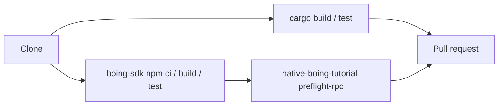

# Contributing to Boing Network

Canonical repository: **[github.com/Boing-Network/boing.network](https://github.com/Boing-Network/boing.network)**.

> 👋 **Everyday users:** issues and feedback are welcome, but you do not need this file to use the chain.
> 🛠️ **Developers:** `cargo test` + `boing-sdk` build/test before a PR. Docs live in [docs/README.md](docs/README.md).
> 🛰️ **Operators:** optional smoke `npm run verify-native-dex-directory-worker` from repo root.



## Quick start

```bash
cargo build
cargo test
```

TypeScript SDK:

```bash
cd boing-sdk && npm ci && npm run build && npm test
```

Tutorial scripts (after SDK build):

```bash
cd examples/native-boing-tutorial && npm ci
npm run preflight-rpc
```

## Documentation

- **Index (users / developers / operators):** [docs/README.md](docs/README.md)
- **Technical reference:** [docs/TECHNICAL-SPECIFICATION.md](docs/TECHNICAL-SPECIFICATION.md), [docs/RPC-API-SPEC.md](docs/RPC-API-SPEC.md)
- **Cross-repo consumers:** [docs/HANDOFF-DEPENDENT-PROJECTS.md](docs/HANDOFF-DEPENDENT-PROJECTS.md), [docs/THREE-CODEBASE-ALIGNMENT.md](docs/THREE-CODEBASE-ALIGNMENT.md)
- **PDFs:** from `website/`, `npm run build:pdfs` (Mermaid diagrams in Markdown are rendered into the PDFs)

When you change behavior that is documented, update the Markdown **in the same PR**. Website `/docs` and `/about` PDFs should stay aligned with `docs/`.

## Pull requests

- Keep changes focused; match existing style in touched files.
- For Rust: `cargo fmt` / `cargo clippy` as appropriate before pushing.
- For `boing-sdk`: run `npm run build` and `npm test` after TypeScript changes, and commit updated `dist/` when source changes.
- Optional smoke against the deployed native DEX directory Worker (from repo root): `npm run verify-native-dex-directory-worker` — see [docs/HANDOFF_NATIVE_DEX_DIRECTORY_R2_AND_CHAIN.md](docs/HANDOFF_NATIVE_DEX_DIRECTORY_R2_AND_CHAIN.md).

## Website / Cloudflare

See [docs/WEBSITE-AND-DEPLOYMENT.md](docs/WEBSITE-AND-DEPLOYMENT.md).
