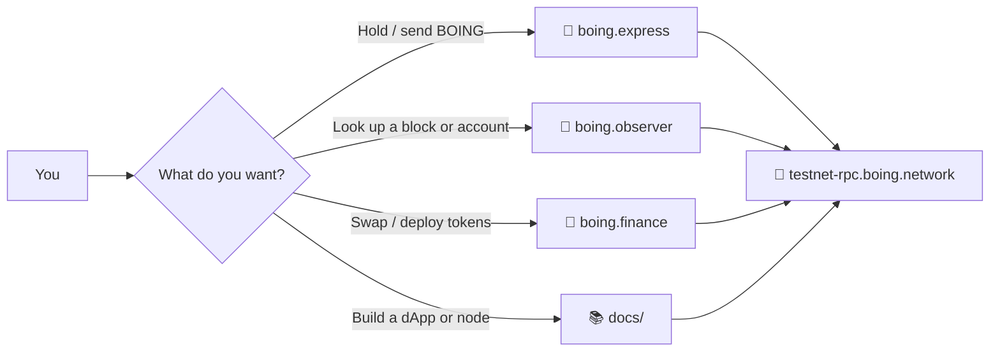

# Boing Network

Authentic, decentralized L1 — built from first principles, with protocol-enforced quality assurance.

> 👋 **Everyday users** start with a wallet, faucet, and explorer.  
> 🛠️ **Developers** start with JSON-RPC, `boing-sdk`, and the native DEX tutorial.  
> 🛰️ **Operators** start with a node binary, bootnodes, and the runbook.

## 🗺️ Where to go



| I want to… | Go here |
|---|---|
| 👛 Create a wallet and get testnet BOING | [boing.express](https://boing.express) → [Faucet](https://boing.network/faucet) |
| 🔭 Browse blocks, accounts, QA, and DEX | [boing.observer](https://boing.observer) |
| 💱 Swap and deploy on Boing (and other chains) | [boing.finance](https://boing.finance) |
| 📖 Read the written pillars | [docs/SIX-PILLARS.md](docs/SIX-PILLARS.md) · [PDF](website/public/pdfs/SIX-PILLARS.pdf) |
| 🛠️ Call JSON-RPC or ship a dApp | [docs/RPC-API-SPEC.md](docs/RPC-API-SPEC.md) · [docs/BOING-DAPP-INTEGRATION.md](docs/BOING-DAPP-INTEGRATION.md) |
| 🛰️ Run a node or join testnet | [docs/TESTNET.md](docs/TESTNET.md) · [docs/RUNBOOK.md](docs/RUNBOOK.md) |

**Canonical doc map:** [docs/README.md](docs/README.md). **Contributing:** [CONTRIBUTING.md](CONTRIBUTING.md).

---

## 🚀 Quick start (developers)

```bash
cargo build
cargo run -p boing-node
```

The node serves **JSON-RPC over HTTP POST** on **`http://127.0.0.1:8545/`** by default (`--rpc-port` to change).

```bash
curl -s -X POST http://127.0.0.1:8545/ -H "Content-Type: application/json" \
  -d '{"jsonrpc":"2.0","id":1,"method":"boing_health","params":[]}'
```

**Public testnet RPC:** `https://testnet-rpc.boing.network/` (Cloudflare Worker failover to Fly `boing-testnet-1` / `boing-testnet-2`). Do not point that hostname at a home tunnel.

**TypeScript:** build the in-repo SDK (`boing-sdk/`) then consume it as a workspace / `file:` package. See [boing-sdk/README.md](boing-sdk/README.md).

**Tutorial CLI from repo root** (after `boing-sdk` build + `examples/native-boing-tutorial` install): `npm run preflight-rpc`, `npm run deploy-native-dex-full-stack`, `npm run fetch-native-amm-reserves`, `npm run print-native-dex-routes`. Full command map: [docs/PRE-VIBEMINER-NODE-COMMANDS.md](docs/PRE-VIBEMINER-NODE-COMMANDS.md).

The `boing-node` binary does **not** auto-create pools or seed reserves on first start. Operators run the tutorial orchestrator against a live RPC when they want a native DEX stack.

---

## ⚙️ Node operators

Set **`BOING_CHAIN_ID`** and **`BOING_CHAIN_NAME`** so `boing_getNetworkInfo` and `boing_health` expose chain metadata to wallets ([docs/RPC-API-SPEC.md](docs/RPC-API-SPEC.md)).

Browser dApps need CORS: extra origins via **`BOING_RPC_CORS_EXTRA_ORIGINS`**. **`GET /ws`** supports a **newHeads** WebSocket (handshake in `boing_getNetworkInfo.developer`). Machine-readable API: `boing_getRpcMethodCatalog` and `boing_getRpcOpenApi`.

Ops probes on the same port: **`GET /live`**, **`GET /ready`**, JSON-RPC batch on **`POST /`**, optional **`X-Request-Id`**. See the root README historically packed these details — they now live with the rest of the RPC surface in the spec.

Hosted bootnodes:

- `/ip4/169.155.48.188/tcp/4001`
- `/ip4/109.105.220.118/tcp/4001`

Details: [docs/FLY-IO.md](docs/FLY-IO.md), [docs/VIBEMINER-INTEGRATION.md](docs/VIBEMINER-INTEGRATION.md).

---

## 📦 Crates

| Crate | Description |
|-------|-------------|
| `boing-primitives` | Types, hashing (BLAKE3), cryptography |
| `boing-consensus` | PoS + HotStuff BFT |
| `boing-state` | State store (sparse Merkle commitments today; Verkle documented as an upgrade path) |
| `boing-execution` | VM + parallel transaction scheduler |
| `boing-tokenomics` | Emission and block-timing constants shared by node/consensus |
| `boing-automation` | Scheduler, triggers, executor incentives |
| `boing-governance` | Governance types and helpers used by the protocol stack |
| `boing-telemetry` | Structured logging and RPC telemetry helpers |
| `boing-qa` | Protocol QA: Allow/Reject/Unsure checks for deployment ([QUALITY-ASSURANCE-NETWORK.md](docs/QUALITY-ASSURANCE-NETWORK.md)) |
| `boing-cli` | `boing init`, `boing dev`, `boing deploy` |
| `boing-p2p` | libp2p networking |
| `boing-node` | Node binary |

---

## 📚 Docs

All project documentation lives in **[docs/](docs/)**. Start at the **[docs index](docs/README.md)** — it splits **everyday users**, **developers**, and **operators**.

| Doc | Description |
|-----|-------------|
| [**docs/README.md**](docs/README.md) | **Index of all `docs/*.md` files** — pick your path |
| [SIX-PILLARS.md](docs/SIX-PILLARS.md) | Written six pillars (also PDF on `/about`) |
| [BOING-NETWORK-ESSENTIALS.md](docs/BOING-NETWORK-ESSENTIALS.md) | Stack, crates, design philosophy |
| [TECHNICAL-SPECIFICATION.md](docs/TECHNICAL-SPECIFICATION.md) | Crypto, data formats, bytecode, gas, RPC, QA rules |
| [RPC-API-SPEC.md](docs/RPC-API-SPEC.md) | JSON-RPC reference, including DEX discovery |
| [TESTNET.md](docs/TESTNET.md) | Join testnet, portal, incentivized program |
| [RUNBOOK.md](docs/RUNBOOK.md) | Operational runbook for node operators |
| [BOING-DAPP-INTEGRATION.md](docs/BOING-DAPP-INTEGRATION.md) | dApp checklist + SDK patterns |
| [THREE-CODEBASE-ALIGNMENT.md](docs/THREE-CODEBASE-ALIGNMENT.md) | Wallet, explorer, website URLs and env |

---

## 🌐 Website & ecosystem

The [boing.network](https://boing.network) website lives in `website/` (Astro → Cloudflare Pages). See `website/README.md` and [docs/WEBSITE-AND-DEPLOYMENT.md](docs/WEBSITE-AND-DEPLOYMENT.md).

| App | URL | Description |
|-----|-----|-------------|
| **Explorer** | [boing.observer](https://boing.observer) | Blocks, accounts, search, QA, DEX directory |
| **Wallet** | [boing.express](https://boing.express) | Non-custodial Boing wallet (web + extension) |
| **DeFi** | [boing.finance](https://boing.finance) | Cross-chain app with a native Boing L1 path |

---

## 🧭 Priorities

**Security → Scalability → Decentralization → Authenticity → Transparency → True quality assurance.**

Protocol QA: only quality assets on-chain; automation first; community pool for edge cases; leniency for meme culture; no malice. See [BOING-NETWORK-ESSENTIALS.md](docs/BOING-NETWORK-ESSENTIALS.md) and [QUALITY-ASSURANCE-NETWORK.md](docs/QUALITY-ASSURANCE-NETWORK.md).
