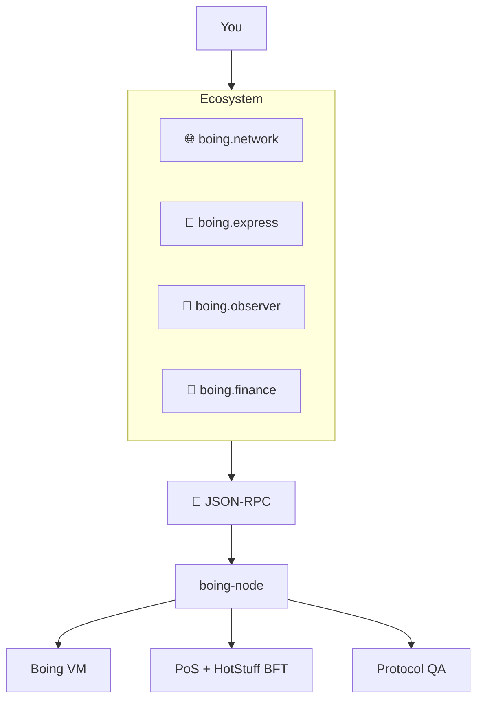

# Boing Network — Essentials

> 👋 **Everyday users:** the six pillars, the stack in one table, and where to click next.  
> 🛠️ **Developers:** crates, RPC defaults, and the spec index.  
> 🛰️ **Operators:** the same facts wallets and explorers depend on.

**One place for the essentials of the Boing blockchain network:** the six pillars, design philosophy, priorities, tech stack, and pointers to the rest of the docs.

---

## What is Boing Network?

**Boing Network** is an authentic, decentralized **L1 blockchain** built from first principles. It is optimized for efficiency, free from dependencies on other chains, and committed to **100% transparency** and **true quality assurance** at the protocol layer. This document summarizes the core commitments and where to go for detail.

Public testnet RPC: **`https://testnet-rpc.boing.network/`**. Addresses are **32-byte** Ed25519 account ids (64 hex chars, optional `0x`) — not 20-byte EVM addresses.

---

## The six pillars

The written pillars live in [SIX-PILLARS.md](SIX-PILLARS.md) and are published as **`/pdfs/SIX-PILLARS.pdf`** on the websites. Summary:

The Boing blockchain prioritizes, in order:

| # | Pillar | What it means |
|---|--------|----------------|
| **1** | 🔐 **Security** | Safety and correctness over speed. |
| **2** | ⚡ **Scalability** | Throughput and efficient resource use. |
| **3** | 🌍 **Decentralization** | Permissionless participation at every layer. |
| **4** | 🧬 **Authenticity** | Unique architecture and identity (not a fork or framework). |
| **5** | 🔎 **Transparency** | 100% openness in design, governance, and operations — the foundation for community trust. |
| **6** | ✅ **True quality assurance** | Top-notch standards with built-in automation: only assets that meet protocol-defined rules and security bar are allowed on-chain. All currently known edge cases are resolved by the automated regulatory QA system (Allow or Reject); **leniency for meme culture** (meme/community/entertainment are valid purposes), with **no maliciousness or malignancy** allowed. The community QA pool is only for genuinely unknown or policy-mandated cases. See [QUALITY-ASSURANCE-NETWORK.md](QUALITY-ASSURANCE-NETWORK.md). |

---

## Design philosophy

- **Authentic** — Our own architecture, not a fork or framework.
- **Independent** — Core protocol does not depend on another L1 for consensus, execution, or identity.
- **Optimal** — Adopt the best ideas from the ecosystem when they are demonstrably superior.
- **Unique** — A distinct identity and technical story.
- **Decentralized** — Absolute decentralization as a foundational requirement.
- **Transparent** — 100% transparent in how we build, govern, and operate — trust through verifiability, not promises.

---

## Priorities (order of precedence)

When trade-offs arise, the network applies this order:

1. **Security** → 2. **Scalability** → 3. **Decentralization** → 4. **Authenticity** → 5. **Transparency** → 6. **True quality assurance**

---

## Tech stack at a glance

| Layer | Technology |
|-------|------------|
| **Language** | Rust |
| **Hashing** | BLAKE3 |
| **Signatures** | Ed25519 |
| **Consensus** | PoS + HotStuff BFT |
| **State** | Sparse Merkle tree (Verkle target) |
| **Execution** | **Boing VM** (stack-based; defined in `TECHNICAL-SPECIFICATION.md` §7; [BOING-VM-INDEPENDENCE.md](BOING-VM-INDEPENDENCE.md)) |
| **Networking** | libp2p (TCP, Noise, gossipsub, request-response) |
| **Governance** | Phased (proposal → cooling → execution); time-locked |

---

## Crates (implementation)

| Crate | Role |
|-------|------|
| `boing-primitives` | Types, BLAKE3, Ed25519, Transaction, Block, AccountId |
| `boing-consensus` | PoS + HotStuff BFT |
| `boing-state` | State store, state root, checkpoints |
| `boing-execution` | VM, BlockExecutor, TransactionScheduler |
| `boing-tokenomics` | Block emission, dApp incentives |
| `boing-governance` | Time-locked governance, slashing appeal |
| `boing-automation` | Scheduler, triggers, executor incentives, verification |
| `boing-qa` | Protocol QA: Allow/Reject/Unsure for deployments |
| `boing-cli` | `boing init`, `boing dev`, `boing deploy` |
| `boing-p2p` | libp2p networking |
| `boing-node` | Node binary (RPC, mempool, block producer, chain) |

---

## Key documents

| Document | Use it for |
|----------|------------|
| [docs/README.md](README.md) | Full index split by audience |
| [TECHNICAL-SPECIFICATION.md](TECHNICAL-SPECIFICATION.md) | Single source of truth: crypto, data formats, bytecode, gas, RPC, QA rules |
| [BOING-BLOCKCHAIN-DESIGN-PLAN.md](BOING-BLOCKCHAIN-DESIGN-PLAN.md) | Full architecture, innovations, tokenomics, design decisions |
| [QUALITY-ASSURANCE-NETWORK.md](QUALITY-ASSURANCE-NETWORK.md) | Sixth pillar: QA rules, automation, community pool, meme leniency, no malice |
| [BUILD-ROADMAP.md](BUILD-ROADMAP.md) | Implementation phases and progress |
| [RUNBOOK.md](RUNBOOK.md) | Running nodes, RPC, CLI, monitoring, incidents |
| [TESTNET.md](TESTNET.md) | Join testnet, Testnet Portal (registration, quests), incentivized testnet |
| [RPC-API-SPEC.md](RPC-API-SPEC.md) | JSON-RPC methods and error codes |
| [SECURITY-STANDARDS.md](SECURITY-STANDARDS.md) | Protocol, network, application, and operational security |
| [DEVELOPMENT-AND-ENHANCEMENTS.md](DEVELOPMENT-AND-ENHANCEMENTS.md) | SDK, automation, vision; network-wide enhancements |

All docs live in **[docs/](./)**. The [README](../README.md) in the repo root is the short landing page.

---

## Quick reference

| Item | Default / convention |
|------|----------------------|
| **Public RPC** | `https://testnet-rpc.boing.network/` |
| **Local RPC port** | `8545` |
| **Address (AccountId)** | 32 bytes, hex-encoded (64 hex chars; optional `0x` prefix) |
| **Transaction format** | Bincode-serialized; signed with Ed25519 over BLAKE3 signable hash |
| **Node binary** | `cargo run -p boing-node` |
| **CLI** | `boing` (init, dev, deploy, metrics register, completions) |
| **Wallet** | [boing.express](https://boing.express) |
| **Explorer** | [boing.observer](https://boing.observer) |
| **DeFi** | [boing.finance](https://boing.finance) |

---

## Transparency commitment

We commit to 100% transparency in:

- **Protocol design** — Open design docs, public specs, auditable code.
- **Tokenomics** — Emission, fee splits, burn — on-chain and documented.
- **Governance** — On-chain proposals, votes, outcomes.
- **Validator & staking** — Clear slashing, reward formulas, distribution.
- **Security & audits** — Audit reports public; known risks disclosed.
- **Development** — Open source; roadmap and trade-offs discussed openly.

---

*Boing Network — Authentic. Decentralized. Optimal. Sustainable. Quality-assured.*
