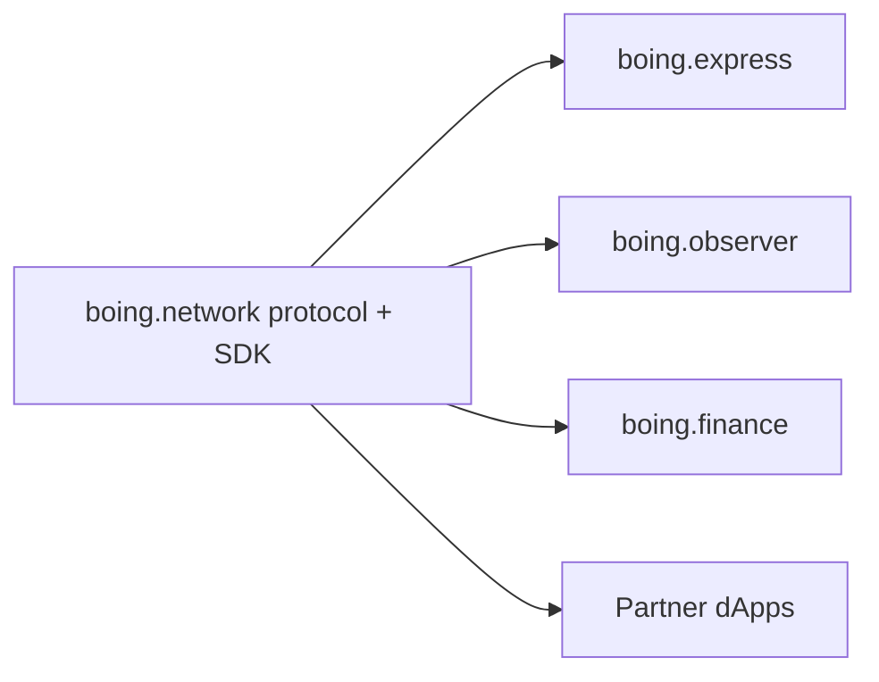

# Handoff: work in dependent projects (Express, Observer, partners)

> 👋 **Everyday users:** skip this — it is an engineering backlog. Use [boing.express](https://boing.express) and [boing.observer](https://boing.observer).  
> 🛠️ **Developers on wallet / explorer / finance:** this is the **shared checklist** of what the protocol repo already ships vs what each app should do next.  
> 🛰️ **Operators:** SDK + tutorial verification commands are in §5 of this file and [PRE-VIBEMINER-NODE-COMMANDS.md](PRE-VIBEMINER-NODE-COMMANDS.md).

This document complements **[THREE-CODEBASE-ALIGNMENT.md](THREE-CODEBASE-ALIGNMENT.md)** (URLs, RPC envs, chain IDs). It records **what already ships in the `boing.network` monorepo** and **recommended next work** for codebases that are **not** this repository—primarily **boing.express** (wallet), **boing.observer** (explorer), and partner frontends (e.g. **boing.finance**).



---

## 1. What this repo (`boing.network`) already provides

Use this as the **upstream contract** for dependent projects. **Canonical GitHub:** [`Boing-Network/boing.network`](https://github.com/Boing-Network/boing.network) (RPC `developer.repository_url` default, website links, **`GET /api/networks`** `meta` doc URLs; legacy `chiku524` release paths may still redirect but are normalized where the API merges listings).

| Area | Location / artifact |
|------|---------------------|
| **Protocol** | `crates/boing-node`, `crates/boing-execution` — VM programs (native CP pool, DEX factory, ledger / swap2 / multihop routers), JSON-RPC |
| **TypeScript SDK** | `boing-sdk/` — RPC client, calldata + access-list builders, directory snapshot (`fetchNativeDexDirectorySnapshot`), routing (`nativeDexRouting.ts`), **`metadataMedia`** + reference NFT storage keys, wallet helpers, preflight (`assertBoingNativeDexToolkitRpc`) |
| **Universal deploy registry (optional Worker)** | `workers/deploy-registry-indexer/` — D1 + cron + HTTP/SSE for every **`ContractDeploy*`** on a chain; not DEX-scoped discovery — [HANDOFF_Universal_Contract_Deploy_Indexer.md](HANDOFF_Universal_Contract_Deploy_Indexer.md) |
| **Operator docs** | `docs/RUNBOOK.md`, `docs/RPC-API-SPEC.md`, `tools/boing-node-public-testnet.env.example` — `BOING_CANONICAL_NATIVE_*` (`CP_POOL`, `DEX_FACTORY`, multihop router, ledger v2/v3, LP vault, share) for `boing_getNetworkInfo.end_user` |
| **Integration specs** | `docs/BOING-DAPP-INTEGRATION.md`, `docs/BOING-NATIVE-DEX-CAPABILITY.md`, `docs/BOING-EXPRESS-WALLET.md`, `docs/BOING-OBSERVER-AND-EXPRESS.md` |
| **Tutorial CLI** | `examples/native-boing-tutorial/scripts/` — including **`print-native-dex-routes`** (off-chain route dump over public RPC) |
| **Website / portal** | `website/` — testnet portal, docs PDFs, links to Explorer / Wallet per alignment doc |

Dependent apps should **pin or track** published `boing-sdk` versions (npm or `file:` / git submodule) and re-run **`npm run build`** in `boing-sdk/` when pulling protocol-side changes.

---

## 2. boing.express (wallet) — recommended work

**Spec in this repo:** [BOING-EXPRESS-WALLET.md](BOING-EXPRESS-WALLET.md) (bootstrap, signing, RPC methods, portal).

| Priority | Item | Notes |
|----------|------|--------|
| **P0** | **`boing_sendTransaction`** for **`contract_call`** | Must accept Boing shape: 32-byte `contract`, `calldata`, explicit `access_list` — not only `eth_sendTransaction` 20-byte `to`/`data`. |
| **P0** | **`boing_chainId`** / **`boing_requestAccounts`** | Already the alignment contract; keep parity with [THREE-CODEBASE-ALIGNMENT.md](THREE-CODEBASE-ALIGNMENT.md) §3. |
| **P1** | **`boing_simulateTransaction`** UX | Surface `suggested_access_list` / retry flow; mirror copy in [BOING-DAPP-INTEGRATION.md](BOING-DAPP-INTEGRATION.md) § swap pre-flight. |
| **P1** | Error mapping | Optionally reuse SDK strings via documentation parity: user-facing text aligned with **`mapInjectedProviderErrorToUiMessage`** and [BOING-RPC-ERROR-CODES-FOR-DAPPS.md](BOING-RPC-ERROR-CODES-FOR-DAPPS.md). |
| **P2** | **Connect** helper parity | SDK exposes **`connectInjectedBoingWallet`**; Express can mirror the same three parallel calls and show **`supportsBoingNativeRpc`** when false (link to install / update). |
| **P2** | Native **DEX** “advanced” | Optional UI to paste **`contract_call`** JSON from tutorial **`native-amm-print-contract-call-tx`** or partner dApps; not required for MVP send. |

**Out of scope for the wallet:** off-chain routing solvers, indexer APIs, CEX-style aggregation — those stay in dApps or backends using **`boing-sdk`**.

---

## 3. boing.observer (explorer) — recommended work

**Spec in this repo:** [BOING-OBSERVER-AND-EXPRESS.md](BOING-OBSERVER-AND-EXPRESS.md) Part 2; optional indexer: [OBSERVER-HOSTED-SERVICE.md](OBSERVER-HOSTED-SERVICE.md).

| Priority | Item | Notes |
|----------|------|--------|
| **P0** | **RPC** config | `NEXT_PUBLIC_TESTNET_RPC` (and mainnet when live) — same URL semantics as alignment doc §2. |
| **P1** | **Token / NFT metadata** | **Shipped:** `/asset/:address` metadata scan, `/tokens` index with thumbnails, reference NFT storage probes — use **`boing-sdk`** **`metadataMedia`** helpers for off-chain JSON/IPFS when extending. |
| **P1** | **Optional “Pools / DEX directory”** | Read-only: use **`fetchNativeDexDirectorySnapshot`** + bounded **`registerLogs`** or durable index ([BOING-OBSERVER-AND-EXPRESS.md](BOING-OBSERVER-AND-EXPRESS.md) §4.3). Avoid full-chain log scans on every page load. |
| **P1** | **Account / tx** views | 32-byte Boing `AccountId` display (no 20-byte assumption); link format per alignment doc. |
| **P2** | **Route / quote** pages | If product wants “best path” UX, depend on **`boing-sdk`** `findBestCpRoutes` / `fetchCpRoutingFromDirectoryLogs` with cached venue list from your indexer. |

---

## 4. Partner dApps (e.g. boing.finance)

| Priority | Item | Notes |
|----------|------|--------|
| **P0** | **Canonical pool / factory** | Keep on-chain ids and env mirrors in sync with [OPS-CANONICAL-TESTNET-NATIVE-AMM-POOL.md](OPS-CANONICAL-TESTNET-NATIVE-AMM-POOL.md) and **`end_user`** hints when users use public RPC. **Done (2026-05-21):** production/staging env + CI **`verify-canonical-testnet-pool-embed.mjs`**. |
| **P1** | **Prefer SDK defaults** | **`fetchNativeDexIntegrationDefaults`** / **`mergeNativeDexIntegrationDefaults`** + optional **`buildNativeDexIntegrationOverridesFromProcessEnv`**. |
| **P1** | **Routing** | **`nativeDexRouting`** for quotes; multihop / pool encoders in **`boing-sdk`**. |
| **P1** | **D1 directory pagination** | Optional **`REACT_APP_BOING_NATIVE_DEX_DIRECTORY_BASE_URL`** + **`fetchNativeDexDirectoryPoolsPage`**; merge indexer stats by **`poolHex`**. Verify: **`npm run verify-native-dex-directory-worker`**. |
| **P2** | **Wallet** | **`providerSupportsBoingNativeRpc`**; steer to Boing Express when false. |
| **Protocol** | **Unsigned simulate, LP positions, history** | [PROTOCOL_NATIVE_DEX_RPC_AND_INDEXING_ROADMAP.md](PROTOCOL_NATIVE_DEX_RPC_AND_INDEXING_ROADMAP.md). |

### Directory API (boing.finance engineers)

**Worker endpoints:** `GET {base}/v1/directory/meta`, `GET {base}/v1/directory/pools?limit=&cursor=` — see [HANDOFF_NATIVE_DEX_DIRECTORY_R2_AND_CHAIN.md](HANDOFF_NATIVE_DEX_DIRECTORY_R2_AND_CHAIN.md).

**Env:** `REACT_APP_BOING_NATIVE_DEX_DIRECTORY_BASE_URL` — Worker **origin only** (no path).

**SDK:** `fetchNativeDexDirectoryMeta`, `fetchNativeDexDirectoryPoolsPage`, `collectAllNativeDexDirectoryPools` — **`boing-sdk/src/nativeDexDirectoryApi.ts`**.

**Ops:** Manual sync via Worker secret + `POST /v1/directory/sync`; **`poolCount: 0`** until first cron is expected.

---

## 5. Verification commands (from `boing.network` clone)

```bash
cd boing-sdk && npm ci && npm run build && npm test
cd ../examples/native-boing-tutorial && npm ci
BOING_RPC_URL=https://testnet-rpc.boing.network \
  TOKEN_IN=0x… TOKEN_OUT=0x… AMOUNT_IN=1000000 \
  node scripts/print-native-dex-routes.mjs
```

Cross-repo smoke: public RPC + **`preflight-rpc`**, **`check-testnet-rpc`** ([PRE-VIBEMINER-NODE-COMMANDS.md](PRE-VIBEMINER-NODE-COMMANDS.md)).

---

## 6. Change coordination

When **`boing_getNetworkInfo`**, canonical env names, or SDK **breaking** exports change:

1. Update **this repo** (RPC spec, RUNBOOK, SDK, website if needed).
2. Bump **consumer** apps (Express, Observer, finance) in the same release train when possible.
3. Refresh **[THREE-CODEBASE-ALIGNMENT.md](THREE-CODEBASE-ALIGNMENT.md)** if URLs, env var names, or chain IDs change.

**Contact surface:** treat **`docs/`** in `Boing-Network/boing.network` as normative for protocol + SDK; file issues/PRs there first for spec gaps.
