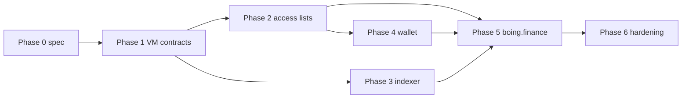

# Native AMM integration checklist (Boing L1 → wallets → boing.finance)

This is the **end-to-end** work list to go from “AMM as a pattern on paper” ([BOING-PATTERN-AMM-LIQUIDITY.md](BOING-PATTERN-AMM-LIQUIDITY.md)) to **swaps and liquidity on chain 6913** inside **boing.finance** (and partner dApps). Order is **dependency-first**; parallelizable rows are called out.

---

## Phase 0 — Freeze scope and interfaces

- [x] **A0.1** — **Frozen:** single **ledger-only** CP pool (two reserves); no token `CALL` in this bytecode (see [NATIVE-AMM-CALLDATA.md](NATIVE-AMM-CALLDATA.md) § Frozen MVP scope).
- [x] **A0.2** — **Calldata** per method documented in [NATIVE-AMM-CALLDATA.md](NATIVE-AMM-CALLDATA.md) (selectors, 128-byte words, u128 low 16 bytes).
- [x] **A0.3** — **Logs:** none in current bytecode — documented as indexer gap until `LOG` opcodes are added ([NATIVE-AMM-CALLDATA.md](NATIVE-AMM-CALLDATA.md)).
- [x] **A0.4** — **QA category** for deploy flows: use **`dapp`** / **`tooling`** (and related allowed categories) per [QUALITY-ASSURANCE-NETWORK.md](QUALITY-ASSURANCE-NETWORK.md); noted in calldata doc.
- [x] **A0.5** — Align [NATIVE-AMM-CALLDATA.md](NATIVE-AMM-CALLDATA.md) with the first pool bytecode PR (selectors, word counts); bump doc from **draft** to **v1** when merged.

---

## Phase 1 — On-chain artifacts (Boing VM)

- [x] **A1.1** (MVP) — **Reference pool bytecode** in `crates/boing-execution/src/native_amm.rs` (`constant_product_pool_bytecode`): no fee, u64-safe math, `swap` + `add_liquidity` + `remove` no-op. **Still open:** fees, LP shares, reference-token `CALL`, u128-full multiply if VM gains wide `MUL`.
- [x] **A1.2** — **Factory skipped for MVP:** fixed pool **`AccountId`** via config / env (see [NATIVE-AMM-CALLDATA.md](NATIVE-AMM-CALLDATA.md) § Frozen MVP scope).
- [x] **A1.3** — VM integration in `boing-execution` + **node RPC** test `native_amm_rpc_happy_path` (deploy → add liquidity → swap; storage assertions). **Still open:** `remove_liquidity` coverage when bytecode supports it.
- [x] **A1.4** — **CI:** `constant_product_pool_bytecode_passes_protocol_qa` in `boing-execution` (`check_contract_deploy_full` with `purpose_category: dapp`). Operators should still run **`boing_qaCheck`** against the **hex from `dump_native_amm_pool`** before production deploys.
- [x] **A1.5** — **Procedure:** pool id is **operator-published**; dApps set **`REACT_APP_BOING_NATIVE_AMM_POOL`** / `nativeConstantProductPool`. **Still open:** replace all-zero placeholder in repo `contracts.js` when a long-lived public testnet pool is announced (same as **A6.4**).

---

## Phase 2 — Access lists & simulation

- [x] **A2.1** — **Minimal access list** per tx type: table in [NATIVE-AMM-CALLDATA.md](NATIVE-AMM-CALLDATA.md) § Minimal access list by tx type.
- [x] **A2.2** (pool-only) — **boing.finance** passes explicit **`access_list`** `{ read/write: [sender, pool] }` on native CP `contract_call`; **`boingExpressContractCallSignSimulateSubmit`** runs **`boing_simulateTransaction`** and widens the list when **`access_list_covers_suggestion === false`**. **Still open:** extra accounts when pool adds **`CALL`** to tokens.
- [x] **A2.3** — **SDK** (`boing-sdk/src/nativeAmmPool.ts`): `buildNativeConstantProductContractCallTx`, `buildNativeConstantProductPoolAccessList`, `mergeNativePoolAccessListWithSimulation` (uses `mergeAccessListWithSimulation`).

---

## Phase 3 — RPC & indexing

- [x] **A3.1** — **`boing_getTransactionReceipt`:** `success`, `error`, `return_data`, `logs` per [RPC-API-SPEC.md](RPC-API-SPEC.md) — sufficient for failed swap diagnostics.
- [x] **A3.2** — **Canonical MVP path:** **configured pool id** + **`boing_getContractStorage`** for reserves; **no log-based discovery** until the pool emits events. **`boing_getLogs`** remains the path when logs exist ([Track R10](EXECUTION-PARITY-TASK-LIST.md)).
- [x] **A3.3** — **Documented default:** no separate HTTP service — use **`boing_getContractStorage`** (×2 for reserves) or JSON-RPC batch; see [NATIVE-AMM-CALLDATA.md](NATIVE-AMM-CALLDATA.md) § Pool metadata without a separate HTTP API. **Still open:** optional subgraph / REST if product needs multi-pool discovery.

---

## Phase 4 — Boing Express / wallet

- [x] **A4.1** — **Native AMM path** builds **`contract_call`** with explicit **`access_list`** (signer + pool); Express signs whatever the dApp passes — widen via simulation when the node suggests more accounts.
- [x] **A4.2** — **Wallet / dApp UX** for native CP swap: [BOING-DAPP-INTEGRATION.md](BOING-DAPP-INTEGRATION.md) § Native constant-product swap (Boing VM).
- [ ] **A4.3** — Add or extend **E2E test** (extension + dApp origin) for one happy-path swap on testnet.

---

## Phase 5 — boing.finance (frontend)

- [x] **A5.1** — **`contracts.js` (6913):** dedicated **`nativeConstantProductPool`** (32-byte id) + env override; EVM **`dexRouter` / `dexFactory`** stay zero on native L1 until a bridged DEX exists.
- [x] **A5.2** (calldata) — **Rust + TS encoders** match [NATIVE-AMM-CALLDATA.md](NATIVE-AMM-CALLDATA.md). **Still open:** optional view-call ABI for reserves.
- [x] **A5.3** — **boing.finance:** env / `contracts.js` pool id, `NativeAmmSwapPanel` (swap + **add liquidity** `0x11`), `access_list` + **sign → simulate → merge → submit** via `boingExpressContractCallSignSimulateSubmit`, reserve reads via RPC. **Still open:** hardcode canonical testnet pool in `contracts.js` when ops publishes a long-lived id.
- [x] **A5.4** — **Quote path:** in-panel `constantProductAmountOut` from storage-loaded reserves (matches on-chain formula for u64-safe inputs).
- [x] **A5.5** — **Swap UI:** `contract_call` via **Boing Express** `boing_sendTransaction` on chain **6913** when pool configured; EVM swap paths unchanged on other chains.
- [x] **A5.6** — **Pools / Create pool / Swap:** `getFeatureSupport(...).hasNativeAmm` (from `featureSupport.js` + `nativeConstantProductPool` in `contracts.js`) hides **`NativeBoingL1IntegratedHub`** on **6913** when native pool is set; **`NativeAmmLiquidityRoutesHint`** on Create pool & Pools points users to **`/swap`**.
- [x] **A5.7** — **Error mapping:** **`formatBoingExpressRpcError`** on native AMM submit paths (QA / nested RPC `data`).

---

## Phase 6 — Hardening & launch

- [x] **A6.1** — **Property tests:** `crates/boing-execution/tests/proptest_native_amm.rs` (amount out ≤ reserve out, product invariant non-decreasing after swap).
- [x] **A6.2** — Documented in [NATIVE-AMM-CALLDATA.md](NATIVE-AMM-CALLDATA.md) § Slippage, deadline, upgrade policy.
- [x] **A6.3** — Same section + boing.finance **Native AMM** panel copy (immutable MVP).
- [x] **A6.4** — **[RPC-API-SPEC.md](RPC-API-SPEC.md)** integration note (pool id from config; `boing_getContractStorage` keys; link to calldata doc + node test). **Still open:** insert **concrete public testnet pool hex** in spec + `contracts.js` when ops freezes it.

---

## Quick dependency graph

---

## Related docs

| Doc | Role |
|-----|------|
| [NATIVE-AMM-CALLDATA.md](NATIVE-AMM-CALLDATA.md) | Draft selectors + calldata layout + example hex |
| [BOING-PATTERN-AMM-LIQUIDITY.md](BOING-PATTERN-AMM-LIQUIDITY.md) | Pattern and storage/event guidance |
| [BOING-REFERENCE-TOKEN.md](BOING-REFERENCE-TOKEN.md) | Token contract interop |
| [QUALITY-ASSURANCE-NETWORK.md](QUALITY-ASSURANCE-NETWORK.md) | Deploy QA categories |
| [EXECUTION-PARITY-TASK-LIST.md](EXECUTION-PARITY-TASK-LIST.md) | VM / receipts / logs foundation |

---

## Suggested next concrete artifact

**Calldata v1:** [NATIVE-AMM-CALLDATA.md](NATIVE-AMM-CALLDATA.md). **Next:** publish **canonical testnet pool `AccountId`** (close **A6.4** remainder), add pool **`LOG`** + indexer path, optional **Playwright** against Boing Express, fees/LP shares (**A1.1** follow-ups).
