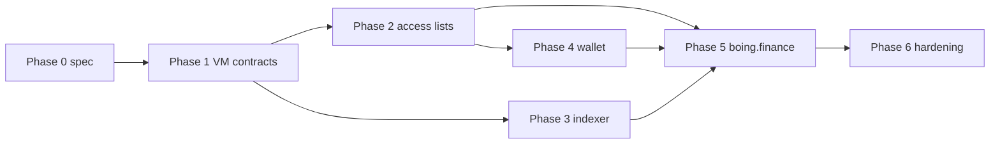

# Native AMM integration checklist (Boing L1 → wallets → boing.finance)

This is the **end-to-end** work list to go from “AMM as a pattern on paper” ([BOING-PATTERN-AMM-LIQUIDITY.md](BOING-PATTERN-AMM-LIQUIDITY.md)) to **swaps and liquidity on chain 6913** inside **boing.finance** (and partner dApps). Order is **dependency-first**; parallelizable rows are called out.

---

## Phase 0 — Freeze scope and interfaces

- [ ] **A0.1** — Choose **one** MVP surface: e.g. **single pool contract** (two reserves in storage) + **reference-token** legs, or **native BOING + one reference token** (simpler QA/access list).
- [ ] **A0.2** — Document **calldata layout** per method (`swap`, `add_liquidity`, `remove_liquidity`): selector/discriminator, argument order, endianness, max sizes (align with [BOING-REFERENCE-TOKEN.md](BOING-REFERENCE-TOKEN.md) 96-byte style or explicitly diverge and document).
- [ ] **A0.3** — Document **event/log** payload for indexers (topic0 + indexed fields) so subgraph-style services can list pools and volumes.
- [ ] **A0.4** — Pick **QA `purpose_category`** for factory/pool deploys (`dApp` / `tooling` per pattern doc); record in deploy metadata.
- [ ] **A0.5** — Align [NATIVE-AMM-CALLDATA.md](NATIVE-AMM-CALLDATA.md) with the first pool bytecode PR (selectors, word counts); bump doc from **draft** to **v1** when merged.

---

## Phase 1 — On-chain artifacts (Boing VM)

- [ ] **A1.1** — Implement **pool contract** bytecode: constant-product math with **checked** arithmetic, fee (e.g. 30 bps), rounding favors pool.
- [ ] **A1.2** — Implement **factory** (optional for MVP): deploy pool instances or register pool addresses; if skipped, use **fixed pool address(es)** in config for testnet.
- [ ] **A1.3** — Integration tests against **local node** or CI harness: deploy → add liquidity → swap → remove; assert storage/reserves and receipts ([Track R](EXECUTION-PARITY-TASK-LIST.md)).
- [ ] **A1.4** — Run **`boing_qaCheck`** on production bytecode before mainnet-class deploys; fix static rule hits in `boing-qa` if false positives.
- [ ] **A1.5** — Publish **deployed addresses** on Boing testnet: factory (if any), **router-orchestrator** contract (if swaps are multi-call), canonical **WBOING** or reference-token addresses used by the pool.

---

## Phase 2 — Access lists & simulation

- [ ] **A2.1** — For each tx type (swap, mint LP, burn LP), define **minimal access list** (pool + tokens + sender); document in this repo or partner guide.
- [ ] **A2.2** — Verify with **`boing_simulateTransaction`** and **`suggested_access_list`**; tighten until simulation matches execution on testnet.
- [ ] **A2.3** — Add **SDK helpers** (`boing-sdk`): build tx object for `contract_call` with merged access list (reuse `mergeAccessListWithSimulation` pattern if present).

---

## Phase 3 — RPC & indexing

- [ ] **A3.1** — Confirm **receipts** expose enough data for failed swaps (revert reason / error) for wallet UX.
- [ ] **A3.2** — **Indexer path**: either **boing_getLogs** range queries ([Track R10](EXECUTION-PARITY-TASK-LIST.md)) or contract-storage-based discovery; document **canonical** approach for boing.finance “pool list.”
- [ ] **A3.3** — Optional: lightweight **HTTP API** or subgraph mapping **pool address → token addresses + reserves** (if not read purely via `contract_call` reads).

---

## Phase 4 — Boing Express / wallet

- [ ] **A4.1** — Ensure **Boing Express** can sign **`contract_call`** txs with **explicit access lists** for AMM paths (no silent defaults that omit token contracts).
- [ ] **A4.2** — Document **wallet UX** copy for “native swap” vs EVM (32-byte accounts, simulation step).
- [ ] **A4.3** — Add or extend **E2E test** (extension + dApp origin) for one happy-path swap on testnet.

---

## Phase 5 — boing.finance (frontend)

- [ ] **A5.1** — Extend **`frontend/src/config/contracts.js`**: for `BOING_NATIVE_L1_CHAIN_ID` (6913), set **`dexRouter`** / **`dexFactory`** (or new **`nativeAmmRouter`** / **`nativePool`**) to **deployed VM contract addresses** (not EVM ABI addresses unless you bridge semantics—prefer separate keys).
- [ ] **A5.2** — Add **native AMM ABI layer**: either minimal JSON ABI for **view** calls (if exposed as contract reads) or **raw calldata builders** matching Phase 0 layout.
- [ ] **A5.3** — Branch **`featureSupport.js`** (and Swap / CreatePool / Pools): when **router configured on 6913**, treat swap/pool as **supported**; otherwise keep **`NativeBoingL1IntegratedHub`** behavior.
- [ ] **A5.4** — Implement **quote path**: constant-product off-chain estimate **or** `boing_call` / simulate read against pool state (match on-chain rounding).
- [ ] **A5.5** — Swap UI: build **`contract_call`** (or multi-step) tx → **Boing Express** `boing_sendTransaction` when `walletType === 'boingExpress'` and chain 6913; keep MetaMask path on EVM chains only.
- [ ] **A5.6** — Pools / Create pool: same branching; **no** ethers `Contract` against 32-byte accounts without EVM shim.
- [ ] **A5.7** — Error mapping: surface **-32050 QA reject** and simulation failures like existing native deploy flows.

---

## Phase 6 — Hardening & launch

- [ ] **A6.1** — **Fuzz / property tests** for pricing formula (bounded reserves, no underflow).
- [ ] **A6.2** — **Slippage / deadline** semantics documented; enforce on-chain where possible (min out) or document client-only risk.
- [ ] **A6.3** — **Upgrade policy**: immutable pools vs admin pause; communicate in UI.
- [ ] **A6.4** — Update **[RPC-API-SPEC.md](RPC-API-SPEC.md)** / **[BOING-DAPP-INTEGRATION.md](BOING-DAPP-INTEGRATION.md)** with “official” testnet AMM addresses when live.

---

## Quick dependency graph

---

## Related docs

| Doc | Role |
|-----|------|
| [NATIVE-AMM-CALLDATA.md](NATIVE-AMM-CALLDATA.md) | Draft selectors + calldata layout + example hex |
| [BOING-PATTERN-AMM-LIQUIDITY.md](BOING-PATTERN-AMM-LIQUIDITY.md) | Pattern and storage/event guidance |
| [BOING-REFERENCE-TOKEN.md](BOING-REFERENCE-TOKEN.md) | Token contract interop |
| [QUALITY-ASSURANCE-NETWORK.md](QUALITY-ASSURANCE-NETWORK.md) | Deploy QA categories |
| [EXECUTION-PARITY-TASK-LIST.md](EXECUTION-PARITY-TASK-LIST.md) | VM / receipts / logs foundation |

---

## Suggested next concrete artifact

**Draft calldata:** [NATIVE-AMM-CALLDATA.md](NATIVE-AMM-CALLDATA.md). **Next coding step:** pool bytecode implementing **A1.1** + Rust/TS encoders (**A5.2**), then **A0.5** to freeze the doc as v1.
