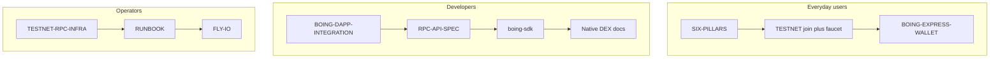

# 📚 Boing Network — Documentation Index

This folder is the **canonical map** of protocol docs. Website pages and PDFs are generated from a subset of these files — keep them aligned with what is actually shipped.

> 👋 **Everyday users:** start with [SIX-PILLARS.md](SIX-PILLARS.md), then the [wallet](https://boing.express), [faucet](https://boing.network/faucet), and [explorer](https://boing.observer).
> 🛠️ **Developers:** start with [BOING-DAPP-INTEGRATION.md](BOING-DAPP-INTEGRATION.md), [RPC-API-SPEC.md](RPC-API-SPEC.md), and [boing-sdk](../boing-sdk/README.md).
> 🛰️ **Operators:** start with [TESTNET.md](TESTNET.md), [TESTNET-RPC-INFRA.md](TESTNET-RPC-INFRA.md), and [RUNBOOK.md](RUNBOOK.md).

Contributors: [CONTRIBUTING.md](../CONTRIBUTING.md).

PDFs on the site (`website/public/pdfs/`) are built with `npm run build:pdfs` in `website/`. Mermaid diagrams in the Markdown are rendered into those PDFs.

---

## 👋 Everyday users

| Doc | What you get |
|-----|----------------|
| [SIX-PILLARS.md](SIX-PILLARS.md) | Why Boing exists, in order of priority (also `/pdfs/SIX-PILLARS.pdf`) |
| [BOING-NETWORK-ESSENTIALS.md](BOING-NETWORK-ESSENTIALS.md) | Stack, crates, and the short map of everything else |
| [TESTNET.md](TESTNET.md) | Join testnet, faucet, portal, quests |
| [BOING-EXPRESS-WALLET.md](BOING-EXPRESS-WALLET.md) | How the wallet works (product lives at boing.express) |
| [BOING-OBSERVER-AND-EXPRESS.md](BOING-OBSERVER-AND-EXPRESS.md) | Explorer + wallet: what each app is for |
| [QUALITY-ASSURANCE-NETWORK.md](QUALITY-ASSURANCE-NETWORK.md) | Allow / Reject / Unsure in plain language + deployer checklist |
| [QA-GATE-RULES.md](QA-GATE-RULES.md) | Operational catalog of every automated gate (also observer `/qa/rules` PDF) |
| [Executive-Summary-Pitch-Deck.md](Executive-Summary-Pitch-Deck.md) | Short pitch (PDF on the site) |

---

## 🛠️ Developers

| Doc | What you get |
|-----|----------------|
| [BOING-DAPP-INTEGRATION.md](BOING-DAPP-INTEGRATION.md) | Connect `window.boing`, simulate, submit, native DEX |
| [RPC-API-SPEC.md](RPC-API-SPEC.md) | JSON-RPC methods, errors, DEX discovery, HTTP probes |
| [TECHNICAL-SPECIFICATION.md](TECHNICAL-SPECIFICATION.md) | Crypto, bincode, VM, gas, QA rules |
| [BOING-RPC-ERROR-CODES-FOR-DAPPS.md](BOING-RPC-ERROR-CODES-FOR-DAPPS.md) | Error codes wallets and UIs should map |
| [BOING-SIGNED-TRANSACTION-ENCODING.md](BOING-SIGNED-TRANSACTION-ENCODING.md) | Signable hash + bincode layout |
| [BOING-CANONICAL-DEPLOY-ARTIFACTS.md](BOING-CANONICAL-DEPLOY-ARTIFACTS.md) | Pinned fungible / NFT bytecode |
| [BOING-REFERENCE-TOKEN.md](BOING-REFERENCE-TOKEN.md) | Reference fungible |
| [BOING-REFERENCE-NFT.md](BOING-REFERENCE-NFT.md) | Reference NFT |
| [E2-PARTNER-APP-NATIVE-BOING.md](E2-PARTNER-APP-NATIVE-BOING.md) | Partner native Boing apps |

### Native DEX and AMM

| Doc | What you get |
|-----|----------------|
| [BOING-NATIVE-DEX-CAPABILITY.md](BOING-NATIVE-DEX-CAPABILITY.md) | What ships today vs EVM-shaped gaps |
| [NATIVE-AMM-INTEGRATION-CHECKLIST.md](NATIVE-AMM-INTEGRATION-CHECKLIST.md) | End-to-end integration + manual E2E smoke |
| [NATIVE-AMM-CALLDATA.md](NATIVE-AMM-CALLDATA.md) | Pool selectors, storage, Log2, CREATE2 salts |
| [NATIVE-DEX-FACTORY.md](NATIVE-DEX-FACTORY.md) | Pair directory VM |
| [NATIVE-DEX-LEDGER-ROUTER.md](NATIVE-DEX-LEDGER-ROUTER.md) | Ledger forwarders v1–v3 |
| [NATIVE-DEX-SWAP2-ROUTER.md](NATIVE-DEX-SWAP2-ROUTER.md) | Two-hop router |
| [NATIVE-DEX-MULTIHOP-SWAP-ROUTER.md](NATIVE-DEX-MULTIHOP-SWAP-ROUTER.md) | Multihop router (2–6 hops) |
| [NATIVE-AMM-LP-VAULT.md](NATIVE-AMM-LP-VAULT.md) | LP vault |
| [NATIVE-LP-SHARE-TOKEN.md](NATIVE-LP-SHARE-TOKEN.md) | LP share token |
| [BOING-L1-DEX-ENGINEERING.md](BOING-L1-DEX-ENGINEERING.md) | L1 DEX engineering overview |
| [HANDOFF_Boing_Network_Global_Token_Discovery.md](HANDOFF_Boing_Network_Global_Token_Discovery.md) | `boing_listDexPools` / `boing_listDexTokens` / `boing_getDexToken` |
| [HANDOFF_NATIVE_DEX_DIRECTORY_R2_AND_CHAIN.md](HANDOFF_NATIVE_DEX_DIRECTORY_R2_AND_CHAIN.md) | Native DEX directory Worker (source of truth) |

---

## 🛰️ Operators and testnet

| Doc | What you get |
|-----|----------------|
| [TESTNET-RPC-INFRA.md](TESTNET-RPC-INFRA.md) | **Operator hub:** go-live order, env matrix, verification |
| [TESTNET.md](TESTNET.md) | Join testnet; **§9.1** node zip release checklist |
| [PRE-VIBEMINER-NODE-COMMANDS.md](PRE-VIBEMINER-NODE-COMMANDS.md) | Copy/paste RPC smoke and tutorial `npm run` commands |
| [INFRASTRUCTURE-SETUP.md](INFRASTRUCTURE-SETUP.md) | Bootnodes, Cloudflare tunnel, VibeMiner alignment |
| [FLY-IO.md](FLY-IO.md) | Hosted two-node testnet on Fly.io + public RPC Worker |
| [PUBLIC-RPC-NODE-UPGRADE-CHECKLIST.md](PUBLIC-RPC-NODE-UPGRADE-CHECKLIST.md) | Upgrade the node behind public JSON-RPC |
| [DEVNET-OPERATOR-NATIVE-AMM.md](DEVNET-OPERATOR-NATIVE-AMM.md) | Self-hosted RPC + deploy native DEX stack |
| [VIBEMINER-INTEGRATION.md](VIBEMINER-INTEGRATION.md) | One-click node; `/api/networks`; Appendix A two-node Windows |
| [OPS-CANONICAL-TESTNET-NATIVE-AMM-POOL.md](OPS-CANONICAL-TESTNET-NATIVE-AMM-POOL.md) | Published canonical pool (**OPS-1**) |
| [OPS-CANONICAL-TESTNET-NATIVE-DEX-AUX.md](OPS-CANONICAL-TESTNET-NATIVE-DEX-AUX.md) | Predicted CREATE2 aux addresses |
| [OPS-FRESH-TESTNET-BOOTSTRAP.md](OPS-FRESH-TESTNET-BOOTSTRAP.md) | Fresh chain + new operator key |
| [NATIVE-DEX-OPERATOR-DEPLOYMENT-RECORD.md](NATIVE-DEX-OPERATOR-DEPLOYMENT-RECORD.md) | Operator deployment snapshots |
| [NATIVE-DEX-FULL-STACK-OUTPUT.md](NATIVE-DEX-FULL-STACK-OUTPUT.md) | `deploy-native-dex-full-stack` JSON reference |
| [WEBSITE-AND-DEPLOYMENT.md](WEBSITE-AND-DEPLOYMENT.md) | boing.network site deploy |
| [PLAYWRIGHT-E2E-CI-OPS.md](PLAYWRIGHT-E2E-CI-OPS.md) | Extension E2E CI limits |

---

## ✅ Quality, security, alignment

| Doc | What you get |
|-----|----------------|
| [QUALITY-ASSURANCE-NETWORK.md](QUALITY-ASSURANCE-NETWORK.md) | Protocol QA, community pool, content blocklist governance |
| [QA-GATE-RULES.md](QA-GATE-RULES.md) | Enforced rule IDs, opcode whitelist, content matching, live vs canonical lists |
| [config/CANONICAL-QA-REGISTRY.md](config/CANONICAL-QA-REGISTRY.md) | QA JSON configs + `npm run apply-public-testnet-qa-policy` |
| [SECURITY-STANDARDS.md](SECURITY-STANDARDS.md) | Protocol, network, application security |
| [THREE-CODEBASE-ALIGNMENT.md](THREE-CODEBASE-ALIGNMENT.md) | Sync boing.network / express / observer / finance |
| [HANDOFF-DEPENDENT-PROJECTS.md](HANDOFF-DEPENDENT-PROJECTS.md) | Cross-repo work backlog |
| [HANDOFF_Universal_Contract_Deploy_Indexer.md](HANDOFF_Universal_Contract_Deploy_Indexer.md) | Universal deploy registry Worker |
| [INDEXER-RECEIPT-AND-LOG-INGESTION.md](INDEXER-RECEIPT-AND-LOG-INGESTION.md) | Receipt + log ingestion spec |
| [OBSERVER-HOSTED-SERVICE.md](OBSERVER-HOSTED-SERVICE.md) | Hosted observer architecture (OBS-1) |
| [INDEXER-OPERATOR-STATS.md](INDEXER-OPERATOR-STATS.md) | Operator stats / leaderboard |

---

## 🗺️ Roadmaps and design

| Doc | What you get |
|-----|----------------|
| [READINESS.md](READINESS.md) | Beta checklist, six pillars, launch-blocking path |
| [BUILD-ROADMAP.md](BUILD-ROADMAP.md) | Implementation phases (historical + remaining) |
| [NEXT-STEPS-FUTURE-WORK.md](NEXT-STEPS-FUTURE-WORK.md) | Backlog router — infra, native AMM, indexer, ops |
| [BOING-VM-CAPABILITY-PARITY-ROADMAP.md](BOING-VM-CAPABILITY-PARITY-ROADMAP.md) | Full-stack capability matrix |
| [EXECUTION-PARITY-TASK-LIST.md](EXECUTION-PARITY-TASK-LIST.md) | VM / receipts / RPC code tasks |
| [DEVELOPMENT-AND-ENHANCEMENTS.md](DEVELOPMENT-AND-ENHANCEMENTS.md) | Strategic vision (non-normative TBD sections) |
| [PROTOCOL_NATIVE_DEX_RPC_AND_INDEXING_ROADMAP.md](PROTOCOL_NATIVE_DEX_RPC_AND_INDEXING_ROADMAP.md) | Protocol drafts: simulate, LP positions, indexer |
| [BOING-BLOCKCHAIN-DESIGN-PLAN.md](BOING-BLOCKCHAIN-DESIGN-PLAN.md) | Architecture, tokenomics, design decisions |
| [BOING-VM-INDEPENDENCE.md](BOING-VM-INDEPENDENCE.md) | Boing VM only — no foreign chain bytecode engines in protocol |
| [BOING-DESIGN-SYSTEM.md](BOING-DESIGN-SYSTEM.md) | Site design tokens |
| [DECENTRALIZATION-AND-NETWORKING.md](DECENTRALIZATION-AND-NETWORKING.md) | P2P, discovery roadmap |
| [BOING-INFRASTRUCTURE-INDEPENDENCE.md](BOING-INFRASTRUCTURE-INDEPENDENCE.md) | Hosting independence |
| [NETWORK-COST-ESTIMATE.md](NETWORK-COST-ESTIMATE.md) | Cost overview |
| [ACCELERATOR-APPLICATIONS.md](ACCELERATOR-APPLICATIONS.md) | Draft accelerator answers |

### Patterns

| Doc | What you get |
|-----|----------------|
| [BOING-PATTERN-AMM-LIQUIDITY.md](BOING-PATTERN-AMM-LIQUIDITY.md) | AMM pattern |
| [BOING-PATTERN-ORACLE-PRICE-FEEDS.md](BOING-PATTERN-ORACLE-PRICE-FEEDS.md) | Oracle pattern (future) |
| [BOING-PATTERN-UPGRADE-PROXY.md](BOING-PATTERN-UPGRADE-PROXY.md) | Upgrade proxy pattern (future) |
| [NATIVE-DEX-LIMITS-RATIONALE.md](NATIVE-DEX-LIMITS-RATIONALE.md) | Why native DEX differs from EVM |
