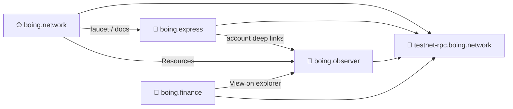

# Three-Codebase Alignment — website, wallet, explorer (and finance)

> 👋 **Everyday users:** the three public apps you will actually open.  
> 🛠️ **Developers:** canonical URLs, RPC env vars, chain IDs (`0x1b01` / 6913 testnet).  
> 🛰️ **Operators:** CORS origins and why upgrading a laptop node does not fix [boing.observer/qa](https://boing.observer/qa).

This document is the **single source of truth** for keeping **boing.network** (website + portal), **boing.express** (wallet), **boing.observer** (block explorer), and **boing.finance** (DeFi app) in sync with the Boing Network and with each other.

**Dependent-project backlog:** [HANDOFF-DEPENDENT-PROJECTS.md](HANDOFF-DEPENDENT-PROJECTS.md).

---

## 1. Canonical URLs

| Role | URL | Used by |
|-----|-----|--------|
| **Main website** | `https://boing.network` | All three (links, docs, canonical) |
| **Block explorer** | `https://boing.observer` | boing.network (footer, Resources), boing.express (explorer links) |
| **Wallet** | `https://boing.express` | boing.network (footer, Resources), boing.observer (header, footer) |

- **boing.network** should link to Explorer and Wallet in footer and on the [Resources](/resources) page.
- **boing.observer** should link to boing.network (faucet, docs, testnet) and boing.express (Wallet) in header and footer.
- **boing.express** should use `https://boing.observer` for explorer deep links (e.g. account: `https://boing.observer/account/<address>`).

---

## 2. RPC endpoints

| Network | Public URL | Notes |
|--------|------------|--------|
| **Testnet** | `https://testnet-rpc.boing.network` or `https://testnet-rpc.boing.network/` | Cloudflare Worker gateway over Fly `boing-testnet-1` / `-2`. Trailing slash optional; all three should normalize (e.g. strip) for consistency. |
| **Mainnet** | TBD | When published, set in env for all three; no silent fallback to testnet. |

### Env / config by codebase

| Codebase | Testnet RPC env | Mainnet RPC env | Default testnet |
|----------|-----------------|-----------------|------------------|
| **boing.network** | `PUBLIC_TESTNET_RPC_URL` | — | `https://testnet-rpc.boing.network/` |
| **boing.express** | `VITE_BOING_TESTNET_RPC` | `VITE_BOING_MAINNET_RPC` | `https://testnet-rpc.boing.network` (no trailing slash) |
| **boing.observer** | `NEXT_PUBLIC_TESTNET_RPC` | `NEXT_PUBLIC_MAINNET_RPC` | `https://testnet-rpc.boing.network` (no trailing slash) |

- **Node CORS:** The boing-node RPC server must allow origins: `https://boing.network`, `https://www.boing.network`, `https://boing.observer`, `https://boing.express`, `https://boing.finance`, `https://www.boing.finance`, and localhost variants. See [INFRASTRUCTURE-SETUP.md](INFRASTRUCTURE-SETUP.md).

### 2.1 QA registry RPC (`boing_getQaRegistry`) — two different surfaces

The same JSON-RPC method exists on **any** `boing-node` that includes it, but **call sites use different URLs**:

| Surface | Who calls it | What to upgrade when you see `Method not found` |
|--------|----------------|--------------------------------------------------|
| **Public testnet RPC** | **boing.observer** `/qa`, website tooling that use `https://testnet-rpc.boing.network/` | The **`boing-node` behind the public RPC gateway** (Fly; see [FLY-IO.md](FLY-IO.md)). Updating a **local** VibeMiner binary does **not** change this URL. |
| **Local RPC** | Browser/tools pointed at `http://127.0.0.1:8545` (e.g. node started from **VibeMiner**) | The **downloaded / running** `boing-node` on that machine (newer GitHub release zip). This does **not** fix boing.observer until the **public** backend is upgraded too. |

**User confusion to avoid:** “I updated VibeMiner / my local node — why does boing.observer/qa still error?” Because the observer uses **`NEXT_PUBLIC_TESTNET_RPC`** (default public testnet), not your PC’s port 8545. Until that public node runs a build with `boing_getQaRegistry`, the explorer shows **Method not found**; use [canonical QA JSON](config/CANONICAL-QA-REGISTRY.md) for a static baseline, or upgrade the hosted Fly node.

**VibeMiner copy** should stress **local binary + listing URL**; **boing.observer copy** should stress **configured RPC URL**. Both are correct; cross-link this section from app hints where helpful.

---

## 3. Chain IDs and network identifiers

For wallet connection and dApp integration (e.g. portal sign-in, chain switching):

| Network | EIP-155–style chain ID | Network ID (internal) |
|---------|-------------------------|------------------------|
| **Testnet** | `0x1b01` (6913) | `boing-testnet` |
| **Mainnet** | `0x1b02` (6914) | `boing-mainnet` |

- **boing.express** exposes these via `boing_chainId` and `boing_switchChain`; the portal and any dApp should use the same values when checking or requesting a network switch.
- **Discovery:** There is no `boing_chainId` JSON-RPC on the node today; chain ID is **not** read from block headers. Operators document the ID for forked networks; **Boing Express** shows the configured hex + decimal on the wallet dashboard. See [DEVNET-OPERATOR-NATIVE-AMM.md](DEVNET-OPERATOR-NATIVE-AMM.md) §1.
- **boing.observer** does not currently implement wallet connect; when it does, it should use the same chain IDs and the same Boing provider/auth contract as the portal (see [BOING-EXPRESS-WALLET.md](BOING-EXPRESS-WALLET.md) Part 3).

### 3.1 Native constant-product pool (testnet, **boing.finance**)

| Item | Value |
|------|--------|
| **Chain** | **6913** (testnet) |
| **Canonical pool `AccountId`** | **Unset on hosted Fly RPC** (`end_user.canonical_native_cp_pool` is `null`). Historical `0x7247ddc3…` was the previous tunnel ledger. |
| **Canonical DEX factory** | **Unset** on hosted Fly RPC. |
| **Multihop router** | **Unset** on hosted Fly RPC. |

- **Docs:** [RPC-API-SPEC.md](RPC-API-SPEC.md) § Native constant-product AMM, [TESTNET.md](TESTNET.md) §5.3, [NATIVE-DEX-OPERATOR-DEPLOYMENT-RECORD.md](NATIVE-DEX-OPERATOR-DEPLOYMENT-RECORD.md) Appendix B.
- **Live RPC:** `boing_getNetworkInfo.end_user` on `https://testnet-rpc.boing.network/`.
- **boing.finance / boing-sdk / website:** must match; **`npm run check-canonical-pool`** is the public smoke test.

---

## 4. Token and address format

- **Symbol:** BOING  
- **Decimals:** 18  
- **Account / address:** 32-byte Ed25519 public key as **64 hex characters**, optional `0x` prefix. All three codebases should accept both with and without `0x` for display and API calls; normalize to a single form when persisting or sending to RPC.

---

## 5. Design and UX alignment

- **Design system:** [BOING-DESIGN-SYSTEM.md](BOING-DESIGN-SYSTEM.md) (in boing.network repo). Dark theme, Orbitron/Inter (and JetBrains Mono for code), glassmorphism, aqua/teal accent, “Boing Observer” / “Boing Express” branding.
- **boing.network:** Astro, `website/src/styles/` (boing-theme, design-tokens-cosmic).
- **boing.observer:** Next.js, Tailwind + CSS variables in `src/app/globals.css` and `tailwind.config.ts`; tokens aligned with the same palette and typography.
- **boing.express:** React/Vite (and extension); theme matches Boing Network (dark UI, aqua/teal).

When adding new pages or components, prefer the same tokens (e.g. `--accent-teal`, `--text-primary`) and fonts so the ecosystem feels cohesive.

---

## 6. Cross-linking checklist

Use this to avoid drift after deployments.

- [x] **boing.network** footer: links to Explorer (boing.observer) and Wallet (boing.express). (`website/src/layouts/Layout.astro`)
- [x] **boing.network** Resources: tiles for “Block Explorer” and “Boing Wallet” pointing to boing.observer and boing.express. (`website/src/pages/resources.astro`)
- [x] **boing.observer** header: “Wallet” link to boing.express; “Get Testnet BOING” to boing.network/faucet. (`src/components/header.tsx`, `NETWORK_FAUCET_URL`)
- [x] **boing.observer** footer: boing.network and boing.express links. (`src/app/layout.tsx`)
- [x] **boing.express** (web + extension): explorer base URL = `https://boing.observer` for account/tx deep links; docs/faucet point to boing.network. (`src/networks/index.ts`, `src/screens/docs/docContent.tsx`)

---

## 7. Infrastructure and deployment

- **RPC:** Single public testnet RPC at `https://testnet-rpc.boing.network/` (Cloudflare Worker → Fly cluster; see [FLY-IO.md](FLY-IO.md)). All three apps depend on it for testnet. **Smoke from this repo:** `examples/native-boing-tutorial` **`npm run preflight-rpc`** with **`BOING_RPC_URL`** (no keys) — [PRE-VIBEMINER-NODE-COMMANDS.md](PRE-VIBEMINER-NODE-COMMANDS.md), [TESTNET-RPC-INFRA.md](TESTNET-RPC-INFRA.md). **VibeMiner (desktop):** sync from **`GET https://boing.network/api/networks`** **`meta`** (download tag, bootnodes, chain id, optional **`ecosystem`** URLs for wallet/explorer/docs) — [VIBEMINER-INTEGRATION.md](VIBEMINER-INTEGRATION.md) §6.
- **Portal (sign-in):** boing.network Cloudflare Pages + Workers (D1 for nonces/sessions). Wallet signs BLAKE3(message) with Ed25519; portal verifies with same stack (@noble/ed25519 + @noble/hashes). See [BOING-EXPRESS-WALLET.md](BOING-EXPRESS-WALLET.md) (Part 3: rollout and smoke test).
- **Self-host:** Optional static + minimal API runbook and vendoring are documented in [BOING-INFRASTRUCTURE-INDEPENDENCE.md](BOING-INFRASTRUCTURE-INDEPENDENCE.md).

When the mainnet RPC URL is published, set the corresponding env in all three codebases and redeploy; do not point mainnet to the testnet URL.

---

## 8. References

- [BOING-OBSERVER-AND-EXPRESS.md](BOING-OBSERVER-AND-EXPRESS.md) — What’s in repo vs what to build; full explorer spec for boing.observer.
- [BOING-EXPRESS-WALLET.md](BOING-EXPRESS-WALLET.md) — Wallet integration, signing, portal 401 troubleshooting.
- [INFRASTRUCTURE-SETUP.md](INFRASTRUCTURE-SETUP.md) — RPC, CORS, Cloudflare Tunnel.
- [RPC-API-SPEC.md](RPC-API-SPEC.md) — Boing JSON-RPC methods used by all three.
- [PRE-VIBEMINER-NODE-COMMANDS.md](PRE-VIBEMINER-NODE-COMMANDS.md) — copy/paste RPC smoke and SDK **`verify`** for operators.
